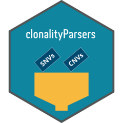

# clonalityParsers 

<!-- badges: start -->
[](https://github.com/pawel125/clonalityParsers/actions/workflows/R-CMD-check.yaml)
[](https://lifecycle.r-lib.org/articles/stages.html#experimental)
[](https://github.com/pawel125/clonalityParsers/actions/workflows/test-coverage.yaml)
<!-- badges: end -->
  
R package for parsing SNV and CNV calls for clonality analysis

## Description

Clonality analysis requires providing SNV and CNV calls to the clonality analysis
algorithm. Since there is a number of CNV and SNV callers and at least the same number of
clonality analysis alorithms, there might be tens of parsing combinations required.
This package is a container for functions parsing SNVs and CNVs to a kind of *universal* format,
and for functions parsing the *universally* formated data to the format required by
clonality algorithms, to facilitate interchangeability of the algorithms.

### Supported algorithms

SNV callers:

- [Mutect2](https://gatk.broadinstitute.org/hc/en-us/articles/360037593851-Mutect2)

CNV callers:

- [FACETS](https://github.com/mskcc/facets)

Clonality analysis algorithms:

- [PyClone-VI](https://github.com/Roth-Lab/pyclone-vi)
- [CliP](https://github.com/wwylab/CliP)

If you would like to get clonalityParsers support your algorithm, let me know in the Issues.

## Installation

```r
remotes::install_github("https://github.com/pawel125/clonalityParsers.git")
```

## Usage

### R

```r
library(clonalityParsers)

FACETS_files <- c(
  S1_P1 = system.file("testdata", "S1_P1.csv", package = "clonalityParsers"),
  S1_L1 = system.file("testdata", "S1_L1.csv", package = "clonalityParsers")
)
Mutect_file <- system.file("testdata", "S1_Mutect.vcf", package = "clonalityParsers")
S1_sample_ids <- c("S1_P1", "S1_L1")
S1_genome_build <- "hg38"
S1_sex <- "male"

td <- read_files(
  Mutect_file, FACETS_files,
  sample_ids = S1_sample_ids, sex = S1_sex, genome_build = S1_genome_build
)

td %>%
  filter_SNVs(filter_min_DP = 10) %>%
  prepare_pycloneVI_input(filename = "S1.pyclone-input.tsv")
```

### Shell

An example script for shell usage is in `inst/example`, along with the conda environments.
